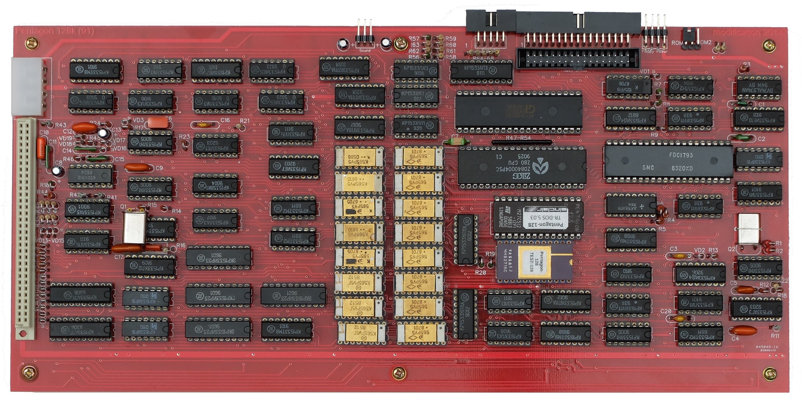

# Pentagon-128 Slim
Один из самых популярных отечественных клонов ZX Spectrum - Pentagon-128 в новой ревизии 2024 года, названный Pentagon-128 Slim

## Немного истории
Игровой компьютер [Pentagon-128](https://ru.wikipedia.org/wiki/%D0%9F%D0%B5%D0%BD%D1%82%D0%B0%D0%B3%D0%BE%D0%BD_(%D0%BA%D0%BE%D0%BC%D0%BF%D1%8C%D1%8E%D1%82%D0%B5%D1%80)https://ru.wikipedia.org/wiki/%D0%9F%D0%B5%D0%BD%D1%82%D0%B0%D0%B3%D0%BE%D0%BD_(%D0%BA%D0%BE%D0%BC%D0%BF%D1%8C%D1%8E%D1%82%D0%B5%D1%80)) (Пентагон 128) был создан в далеком 1991 году, во времена, когда на просторах СССР уже широко были распространены 48-килобайтные ZX Spectrum-совместимые машины, собираемые в больших количествах радиолюбителями-энтузиастами и клонируемые множеством предприятий и кооперативов. Pentagon-128 получил больший объем оперативной памяти (128Кб), контроллер дисковода сразу на плате, а позднее музыкальный процессор AY-3-8910 (или его аналог YM2149) и Kempston джойстик. Благодаря отсутствию дефицитных деталей, доступности схемы и печатных плат, обилию программного обеспечения и фирменных игр Pentagon-128 быстро завоевал популярность и стал самым собираемым компьютером того времени.

Практически все модификации Pentagon-128 имели одну и ту же разводку печатной платы. Плата была достаточно габаритная с широким боковым разъемом и отсутствием крепежных отверстий. Поместить в какой-то более-менее компактный корпус такую плату было нетривиальной задачей. Музыкальный процессор и схема Kempston джойстика устанавливались на отдельной плате, подключались через панельку центрального процессора, тем самым увеличивая высоту конструкции.

Классическая плата 1991 г.

Обновленную плату с интегрированным AY и Kempston изготовили уже только в 2010 и потом модернизировали в 2014. В ней были добавлены SMD блокировочные конденсаторы на оборотной стороне, удалены компоненты, отвечающие за работу принтера, но оставлено ПЗУ на 2 Кб, в которое вместо софта, управляющего принтером, прошили аппаратный тест для наладки ПК. При этом на плате сохранили большой боковой разъем, а добавленный разъем питания (стандартный горизонтальный MOLEX IDE) поставили не совсем верно и оба разъема вместе не помещаются (приходится отпиливать ухо). Также сохранили вертикальное расположение резисторов, и почему-то не добавили транзисторные каскады на выходах RGB. Габариты паты остались практически без изменений.

Плата 2014 г.

Еще одна плата 2014 г.

## Новая плата 2023 г.
В 2023 году завершена работа над топологией новой платы. Плата переразведена полностью, что позволило избавиться от огромного бокового разъема, сделать плату максимально компактной, применить современные разъемы, широкодоступные на AliExpress.
Платы первой ревизии были изготовлены в количестве 15 штук. По отзывам все платы успешно собраны и запущены. 

## Текущая ревизия 2024 г. (v.1.4)

## Отличительные особенности
* Компактный формфактор 312x135 мм, 9 крепежных отверстий по периметру платы.
* Все разъемы вынесены на тыльную сторону и запаиваются сразу на плату. МГТФ больше нет!
* Применены недорогие, легко “доставаемые” комплектующие (стандартные современные дешёвые разъемы с Алиэкспресс).
* Питание подается через разъемы нескольких типов: DC-005, USB-C, расположенных слева и справа, с какой стороны будет удобно.
* Питание 3,5” дисковода (млм эмулятора Gotek) через стандартный разъем подается прямо с платы. В текущей ревизии добавлен еще один разъем питания для подключения двух дисководов.
* Разъемы входа/выхода на магнитофон и Kempston джойстика вынесены на плату клавиатуры и подключаются ленточным кабелем к стандартным разъемам IDC-26 и IDC-10, что выглядит очень аккуратно (нет МГТФ!).
* Вывод стереозвука возможен через разъем DIN-8 на телевизор, а также через 3,5 мм Mini Jack на любое внешнее звуковоспроизводящее устройство, например внешние компьютерные колонки. При подключении Jack в разъем, звук на телевизор (через DIN-8) автоматически отключается.
* Сразу установлены выходные транзисторные каскады RGB выхода с подстроечными резисторами (после настройки выхода под конкретный телевизор можно заменить на обычные).
* Сразу установлен стандартный разъем XH-9A для подключения конвертера RGB->VGA.
* Все резисторы и диоды установлены горизонтально.
* Конвертер +5В в +12В для питания отечественного контроллера дисковода ВГ93 на микросхеме MC34063 разведен на оборотной стороне платы.
* Добавлена возможность установки готового конвертера +5В в +12В DC-DC STEP-UP FIX 5V TO 12V CKCS-BS01.
* Широкие шины питания и обилие блокировочных конденсаторов гарантирует стабильное электроснабжение узлов и надежную работу компьютера.
* Плата не содержит ошибок. После монтажа заведомо исправных деталей компьютер начинает работать сразу.
