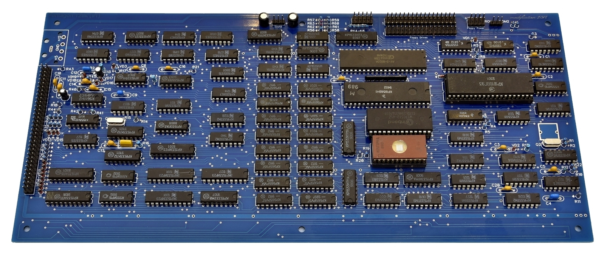
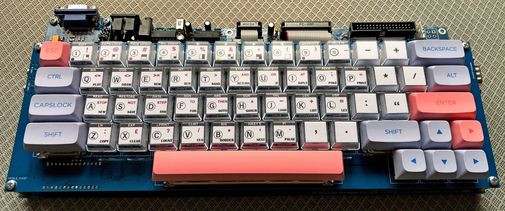

# Pentagon-128 Slim
Один из самых популярных отечественных клонов ZX Spectrum - Pentagon-128 в новой ревизии 2024 года, названный Pentagon-128 Slim

## Немного истории
Игровой компьютер [Pentagon-128](https://ru.wikipedia.org/wiki/%D0%9F%D0%B5%D0%BD%D1%82%D0%B0%D0%B3%D0%BE%D0%BD_(%D0%BA%D0%BE%D0%BC%D0%BF%D1%8C%D1%8E%D1%82%D0%B5%D1%80)) (Пентагон 128) был создан в далеком 1991 году, во времена, когда на просторах СССР уже широко были распространены 48-килобайтные ZX Spectrum-совместимые машины, собираемые в больших количествах радиолюбителями-энтузиастами и клонируемые множеством предприятий и кооперативов. Pentagon-128 получил больший объем оперативной памяти (128Кб), контроллер дисковода сразу на плате, а позднее музыкальный процессор AY-3-8910 (или его аналог YM2149) и Kempston джойстик. Благодаря отсутствию дефицитных деталей, доступности схемы и печатных плат, обилию программного обеспечения и фирменных игр Pentagon-128 быстро завоевал популярность и стал самым собираемым компьютером того времени.

Практически все модификации Pentagon-128 имели одну и ту же разводку печатной платы. Плата была достаточно габаритная с широким боковым разъемом и отсутствием крепежных отверстий. Поместить в какой-то более-менее компактный корпус такую плату было нетривиальной задачей. Музыкальный процессор и схема Kempston джойстика устанавливались на отдельной плате, подключались через панельку центрального процессора, тем самым увеличивая высоту конструкции.

Классическая плата 1991 г.

Обновленную плату с интегрированным AY и Kempston изготовили уже только в 2010 и потом модернизировали в 2014. В ней были добавлены SMD блокировочные конденсаторы на оборотной стороне, удалены компоненты, отвечающие за работу принтера, но оставлено ПЗУ на 2 Кб, в которое вместо софта, управляющего принтером, прошили аппаратный тест для наладки ПК. При этом на плате сохранили большой боковой разъем, а добавленный разъем питания (стандартный горизонтальный MOLEX IDE) поставили не совсем верно, оба разъема вместе не помещались (приходилось отпиливать "ухо"). Также сохранили вертикальное расположение резисторов, и почему-то не добавили транзисторные каскады на выходах RGB. Габариты платы остались практически без изменений.

Плата 2014 г.

Еще одна плата 2014 г.

## Новая плата 2023 г.
В 2023 году завершена работа над новой конструкцией компьютера. Плата переразведена полностью, что позволило избавиться от огромного бокового разъема, сделать плату максимально компактной, применить современные доступные разъемы и комплектующие. Учтены многие конструктивные недоработки прежних версий, из-за которых приходилось буквально опутывать плату Пентагона всеми любиммым МГТФ.
Чтобы получить в итоге полноценный компьютер, компактный, удобный в сборке и использовании, разработана "сэндвич" конструкция. В дополнение к основной плате разведена плата клавиатуры с дополнительными (расширенными) клавишами, которая "садится" сверху на основную плату на стойках, образуя единую компактную конструкцию. Между двумя платами располагаются дополнительные (необязательные) платы расширения: конвертер RGB->VGA и эмулятор дисковода Gotek Slim.

Платы первой ревизии были изготовлены и отправлены заказчикам в количестве 15 штук. По отзывам все платы успешно собраны и запущены. 

## Текущая ревизия 2024 г. (v.1.4)
В начале 2024 г. выпущена следующая ревизия платы (v.1.4), в которую вошли дополнения, сделавшие плату еще более унивесальной и функциональной. Уже собраны первые 5 экземпляров этой ревизии.

## Отличительные особенности конструкции
* Компактный формфактор 312x135 мм, 9 крепежных отверстий по периметру платы.
* Все разъемы основной платы вынесены на тыльную сторону и запаиваются сразу на плату. МГТФ больше нет!
* Применены недорогие, легко “доставаемые” комплектующие (стандартные современные дешёвые разъемы с Алиэкспресс).
* Питание подается через разъемы нескольких типов: DC-005, USB-C, расположенных слева и справа, с какой стороны будет удобно.
* Питание 3,5” дисковода (или эмулятора Gotek) через стандартный разъем подается прямо с платы.
* Разъемы входа/выхода на магнитофон и Kempston джойстика вынесены на плату клавиатуры и подключаются ленточным кабелем к стандартным разъемам IDC-26 и IDC-10, что выглядит очень аккуратно (нет МГТФ!).
* Вывод стереозвука возможен через разъем DIN-8 на телевизор, а также через 3,5 мм Mini Jack на любое внешнее звуковоспроизводящее устройство, например внешние компьютерные колонки. При подключении Jack в разъем, звук на телевизор (через DIN-8) автоматически отключается.
* Сразу установлены выходные транзисторные каскады RGB выхода с подстроечными резисторами (после настройки выхода под конкретный телевизор можно заменить на обычные).
* Сразу установлен стандартный разъем XH-9A для подключения конвертера RGB->VGA.
* Все резисторы и диоды установлены горизонтально.
* Широкие шины питания и обилие блокировочных конденсаторов гарантирует стабильное электроснабжение узлов и надежную работу компьютера.
* Плата не содержит ошибок. После монтажа заведомо исправных деталей компьютер начинает работать сразу.

### Изменения и дополнения новой ревизии 2024 г. v.1.4.
* Добавлена возможность установки микросхем динамической памяти КР565РУ7 (41256) вместо штатных РУ5 (4164). Запайкой солдер-джамперов на обратной стороне платы выбирается одна из конфигураций: 16 микросхем РУ5, 8 микросхем РУ7, 16 микрохем РУ7.
* На плату установлена кнопка Reset.
* Убран разъем питания MOLEX IDE, вмсто него устанолвены разъемы USB TYPE-C с левой и с правой стороны платы.
* Добавлен еще один разъем питания дисковода (горизонтальный).
* На контроллер дисковода ВГ93 (MB8877A) заведен сигнал системного сброса.
* Добавлена возможность установки RC-цепочки в цепи формирования бордера для устранения сдвига бордера относительно экрана на 1 пиксель (заметно в некоторых демо).
* На оборотной стороне платы разведен конвертер +5В в +12В для питания отечественной БИС контроллера дисковода ВГ93.
* Добавлена возможность установки готового конвертера +5В в +12В DC-DC STEP-UP FIX CKCS-BS01, широкодоступного на AliExpress.
* Добавлено крепежное отверстие для надежной фиксации платы эмулятора дисковода Gotek Slim.
